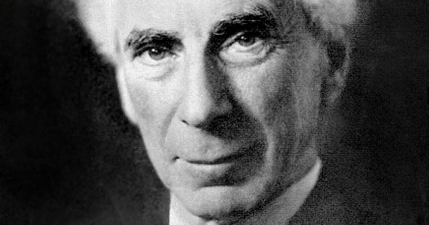
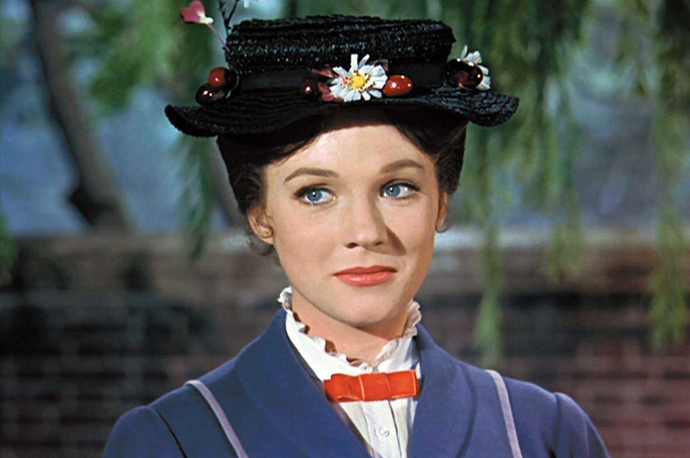

Earlier this year, as I was reflecting on the recent happenings in my life, I was shocked to find out how many unresolved plans and todos I had. My planning and scheduling system was never fully functional. Often, to get the most urgent things done, I had to delete a large part of my todo list. It is a waste of mental energy. If I'm never going to do something, I should have never decided on it. Of course, we need to be flexible and open to changes. But in my case, things that were on my mind and never got resolved were so enormous that I was not able to make feasible plans.

I bought a lot of books but failed to finish reading most of them. Some books even had been lying idle for years. The reading list on my Pocket account keeps growing; the oldest article that needs my attention was almost two years old. Ironically, I had been a Pocket premium member for many years. I had a Kindle with a Kindle Unlimited subscription. Most of the time, when I opened my Kindle, it was because I must charge it regularly to prevent damaging the battery. I also had an Audible subscription, and the unlistened books were hundreds of hours long.

I've collected more than two hundred bookmarks on my Chrome browser. They are courses to learn, articles to read, inspirational sites to revisit regularly, etc. I subscribed to many podcasts but seldom checked them. The unread newsletters in my inbox were almost thousands long. The only way I could deal with them was to delete them in bulk. I bought a lot of courses on Udemy and other platforms but ended up only finishing very few of them. There were also tons of YouTube playlist and free classes on Khan Academy and Coursera that were within my attention radar, but I never got the time to make any progress on them.

However, I hadn't been slacking off. I was mostly disciplined and stoic for the past few years. I also couldn't blame wholly on my job. Being busy doesn't necessarily mean being disorganized.

I concluded that my life needed an overhaul. I must reprioritize things that were pulling at my attention, and give up most of them for the moment. In the entire March, while I was practicing social distancing amid COVID19, I also tried to declutter my life ruthlessly.

Social media and news apps were the first to be chopped off the mess.

## The problems of social media

I'd read _Digital Minimalism_ by Cal Newport one year ago. The arguments against using social media from the book were very compelling. Apart from Cal's observations, I'd like to add some of my own based on my unique experience living in China.

### It's sad, but social discourse seems not working

It's a global phenomenon that people disagree with each other to an extreme level. In the US, liberals can't understand why people support a man so morally corrupt and intellectually inadequate as president. Here in China, It's the same. Chinese liberals also can't comprehend why people mindlessly follow such an oppressive and even murderous regime and its chauvinistic political ambitions.

The two sides don't have conversations anymore. There's no ground for mutual understanding, especially not on social media. The division is so profound that I can invoke Bertrand Russell's letter to the British fascist Sir Oswald Mosley as a parallel here:

<StyledQuote
  texts={[
    ' It is always difficult to decide on how to respond to people whose ethos is so alien and, in fact, repellent to one’s own. It is not that I take exception to the general points made by you but that every ounce of my energy has been devoted to an active opposition to cruel bigotry, compulsive violence, and the sadistic persecution which has characterised the philosophy and practice of fascism.',
    '...',
    'I feel obliged to say that the emotional universes we inhabit are so distinct, and in deepest ways opposed, that nothing fruitful or sincere could ever emerge from association between us.',
  ]}
/>

 _Bertrand Russell_

Every time I saw an intellectually insulting writing piece on WeChat, I felt I was wasting my time on it. Here in China, the situation is different than other places in the world. Anything ever published gets censored, so you can only see what the party sees fit. Articles that tries to correct conspiracy propaganda gets taken down. There can only be one narrative allowed. Dissenting voices are forced to take refugees in small circles.

Having a serious conversation on real issues is mentally draining and futile, and it's magnified by the never-ending feeds of social media.

### Goodbye, intranet inside of intranet

Thanks to the GFW, the Chinese internet is practically an intranet severed from the outside world. The most popular social app WeChat is a giant quasi-independent intranet inside the national intranet. It's hard and unintuitive to quote or to link sources from outside. No https connection, let alone end-to-end encryption. It's the opposite of the idea of an open internet.

### I don't need to get notified more than once

I'm a digital immigrant (thanks to network proxy services). I can still use Twitter and other platforms in the free world, but I've chosen to quit them, too.

The information redundancy is massive with Twitter. Every news gets repeated from too many sources. I know it's a sacred practice of free speech, but it also means there's a deluge of information! I only need to know things from a few professional institutions that I trust.

Most of the time, when I scroll through tweets, I skip most of them. Why keep them in my timeline since I never read them? The unnecessary movements of my thumb and eyeballs are a waste; I can't bear it.

## The problems of news apps

**I don't need to know.** It's a cold blood statement to make when people are dying from war and famine in the middle east; global heating is killing people; a global downslide of political systems is shaping the world in a way we can't tell. The world needs our attention and actions. But for me, knowing things and can't do anything about them makes me wonder if I shouldn't have read so much news in the first place.

I do take actions, though. I donate to the World Food Programme on the official app Share The Meal every two weeks. It's small, but I helped.

**I don't need to know it in real-time.** I don't need the New York Times to notify me as news happens in real-time. I can wait for days before I read them, or most of the time, ignore them. Asynchronously processing news gives me a time buffer to decide wisely later if I really need to know it.

<Tip>
  You can donate to World Food Programme via{' '}
  <a
    href="https://t.co/m2wKxSMFor?amp=1"
    target="_blank"
    rel="noopener">
    Share The Meal
  </a>{' '}
  app
</Tip>

## The problems of both social media and news apps

Social media and news apps killed the empty spaces in my mind. As a programmer, I've been unhealthily busy. When I take a rest, if I mindlessly pull out my phone and consume random contents uncritically, my mind is again clogged with messy stuff. There's no room left for new ideas and Eureka moments. My creativity suffers as a result.

## What I've gained

### A more mindful life

I've tried many times to quit WeChat Moments but failed every time. It's so easy to reenable the feature. This time, I've succeeded. I haven't felt the urge to check it for a month. My mind is more at peace now.

During the past month, I've been taking at least 20 minutes of walk every day. When I was walking, I listened to podcasts and audiobooks. I've already gotten addicted, but it's a healthy addiction.

I didn't quit all the news. My primary source of news is the BBC Global News Podcast program now. I listened to it to keep up with the updates of COVID19 while I was walking in the garden every morning. Another valuable news source is the Global Dispatches podcast. It offers in-depth analyses of world matters that are under-reported.

I also got the opportunity to listen more to podcasts and make exciting and meaningful discoveries. I discovered a lot of beautiful music and singers on the Tiny Desk Concerts podcast, like Maggie Rogers.

### Discover the beauty of doing chores

Since I have cut off unnecessary phone usage, I have more free time to do housework and other chores, like cooking and cleaning. I once considered it a burden and a waste of time to do such tedious work. But I was missing something.

Doing housework creates space in my mind, and that can be more productive than intensive focused work. When I wash dishes, I can continue my thinking on engineering problems; or I simply let my mind wander to wait for new ideas to pop out. Usually, I find this practice extremely rewarding.

As Mary Poppins educates children:

<Callout>
  In every job that must be done, there is an element of fun. You find
  the fun and - SNAP - the job's a game!
</Callout>

_Mary Poppins_

For adults, it's the same. We just need to change our perspective! (Notice another reference to the latest Mary Poppins film?)

## Social media is still valuable!

I don't advocate for the dismantling of social media. In countries of which the government systematically manipulates and suppresses information, people need a tool to speak the truth and fight propaganda. Social media can sometimes be life-saving in such circumstances.

The latest episodes I experienced confirmed this. Later last December, almost a month before the government admitted that there was a coronavirus pandemic in Wuhan, people were already discussing it on Twitter. Once I got the information, I alerted my family against traveling to Wuhan.

For this reason, I still check Twitter occasionally for the news that journalists have no access to.

Also, cute cats and dogs on Twitter help me to stay sane in this troubling time!
